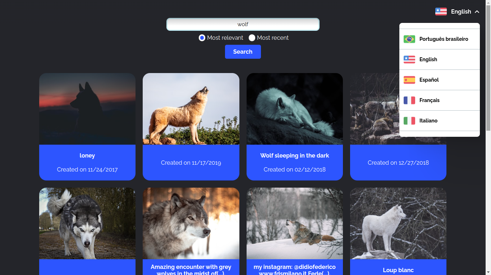
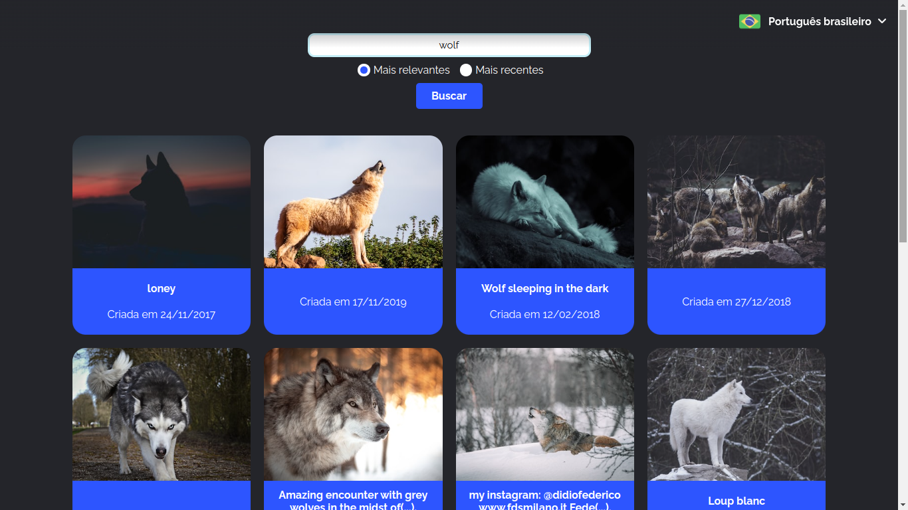
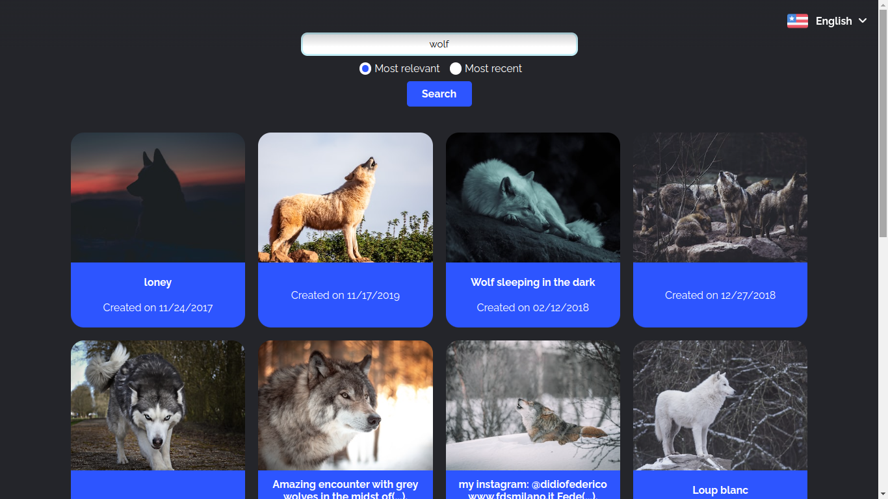

# i15d-fotorama

## Sumário

- [i15d-fotorama](#i15d-fotorama)
  - [Sumário](#sumário)
  - [*To-do list*](#to-do-list)
  - [Motivação](#motivação)
  - [Pilha de tecnologia](#pilha-de-tecnologia)
  - [Galeria](#galeria)
  - [Como rodar](#como-rodar)
    - [Pré-requisitos](#pré-requisitos)
    - [Passo a passo](#passo-a-passo)
  - [Referências bibliográficas](#referências-bibliográficas)

## *To-do list*

- [X] Verificar se é possível pôr o formatador de data no arquivo `i18n/i18next.ts`
- [X] Minimizar o dropdown ao clicar fora
- [X] Testar a função em `react_utils` para detectar cliques fora do componente

## Motivação

Este app é um cliente da plataforma Unsplash, oferecendo aos usuários uma coleção de fotografias de alta qualidade obtidas através da API da Unsplash. A Unsplash é uma plataforma conhecida por compartilhar fotografia proprietária. Desde 2021, pertence à Getty Images e possui uma ampla comunidade de aproximadamente 322.256 fotógrafos contribuintes. A plataforma já gerou mais de 941 bilhões de impressões de fotos por mês, com uma biblioteca diversificada contendo mais de 4,7 milhões de imagens[<sup>[1]</sup>](#referencia-bibliografica-1).

O objetivo principal deste repositório de código foi aprimorar um app existente adicionando suporte aos idiomas inglês, espanhol, francês e italiano. Ele foi desenvolvido anteriormente como atividade da unidade curricular Construção de Páginas Web III e está disponível no repositório de código [mdccg/fotorama](https://github.com/mdccg/fotorama). Observação: "i15d" significa "_internacionalized_" e foi uma brincadeira minha. Vale destacar que o app não traduz o campo `description`, o qual vem da API. Esta implementação conta apenas com a tradução estática das grafias disponíveis no código-fonte.

Este foi o segundo repositório de código apresentado no [Curso Superior de TSI do IFMS](https://www.ifms.edu.br/campi/campus-aquidauana/cursos/graduacao/sistemas-para-internet/sistemas-para-internet) como requisito para obtenção da nota parcial das atividades da unidade curricular Linguagem de Programação IV.

| [&larr; Repositório anterior](https://github.com/mdccg/i18n-demo) | [Próximo repositório &rarr;](#) |
|-|-|

## Pilha de tecnologia

As seguintes tecnologias foram utilizadas para desenvolver este app:

| Papel | Tecnologia |
|-|-|
| Ambiente de execução | [Node](https://nodejs.org/en/) |
| Linguagem de programação | [TypeScript](https://www.typescriptlang.org/) |
| Ambiente de desenvolvimento | [Vite](https://vitejs.dev/) |
| Biblioteca de interface de usuário | [React](https://pt-br.reactjs.org/) |
| Base de dados | [Unsplash](https://unsplash.com/) |

Os créditos pelas mídias utilizadas estão disponíveis [aqui](./src/assets/README.md).

## Galeria





## Como rodar

### Pré-requisitos

- [Node](https://nodejs.org/en/download/);
- [Yarn](https://yarnpkg.com/) (opcional);
- Conta de desenvolvedor no site [Unsplash](https://unsplash.com/developers).

### Passo a passo

1. Clone o repositório de código em sua máquina;
   
2. Abra um shell de comando de sua preferência (prompt de comando, PowerShell, terminal _etc_.);
   
3. Instale as dependências do projeto através do seguinte comando:

```console
$ npm install
```

Caso esteja utilizando o gerenciador de pacotes Yarn, execute o seguinte comando como alternativa:

```console
$ yarn
```

4. Com as dependências instaladas, crie um arquivo intitulado `.env` na raiz do projeto e adicione o seguinte conteúdo nele:

```properties
VITE_UNSPLASH_ACCESS_KEY=
```

Tal arquivo deve conter a chave de acesso de um app registrado pelo site Unsplash. Então, caso ainda não tenha uma conta de desenvolvedor, [registre-se](https://unsplash.com/developers).

5. [Crie um app](https://unsplash.com/oauth/applications) no site Unsplash. É digno de nota que apps recém-criados estarão em modo de demonstração e terão uma taxa limitada de cinquenta requisições por hora;

6. Copie e cole a chave de acesso[<sup>1</sup>](#nota-de-rodape-1) do app criado no valor da variável de ambiente `VITE_UNSPLASH_ACCESS_KEY`;

7. Finalmente, execute o seguinte comando para iniciar o app:

Para npm:

```console
$ npm run dev
```

Para Yarn:

```console
$ yarn dev
```

<sup id="nota-de-rodape-1">1</sup> Cuidado para não confundir a chave de acesso com a chave secreta.

## Referências bibliográficas

<span id="referencia-bibliografica-1">[1]</span> UNSPLASH Stats: See how the Unsplash community has grown over time. [_S_. _l_.]: Unsplash, 7 jan. 2023. Disponível em: https://unsplash.com/stats. Acesso em: 7 jan. 2023.